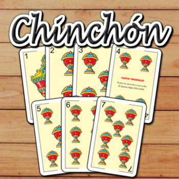
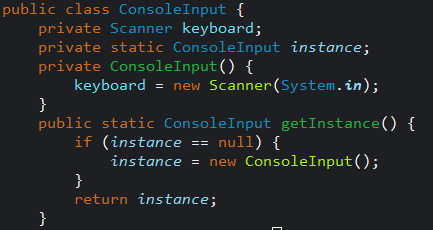
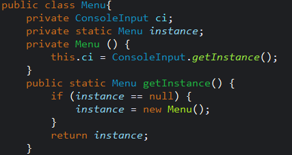
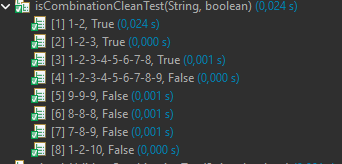

# PROYECTO FINAL DE CURSO 2025/2026 - CHINCHÓN

## Explicación conceptual del proyecto

El proyecto consiste en la realización de un programa en el que se pueda jugar al juego de cartas "Chinchón" (también conocido como "Mono"), que consiste en lo siguiente:

- Se define una puntuación que definirá el momento en el que un jugador que la alcance quedará eliminado.

- Un grupo de jugadores tiene una mano de 7 cartas, mediante la cual deberán realizar combinaciones para acabar teniendo la menor cantidad de puntos (definididos por los valores numéricos de las cartas) sumando todas las  cartas que no hayan podido combinar.

- Para formar combinaciones cada turno consistirá en 2 pasos, el robo y el descarte o cierre, el primero de estos consiste en robar la primera carta de la baraja o coger la carta boca arriba de la pila de descartes y luego descartar una carta o cerrar (usando una carta, siempre los jugadores se deben quedar con 7 cartas al finalizar el turno).

- Para cerrar tienes que tener al menos 6 de las 7 cartas combinadas y no ser el primer turno, al cerrar todos los jugadores usan las combinaciones que tengan y el resto de cartas se suman a los puntos de cada jugador.

- Hay 3 tipos de combinaciones (hay que tener en cuenta que se juega con una baraja española): Iguales (3 o más cartas del mismo valor numérico), Escalera (3 o más cartas consecutivas del mismo palo) y Chinchon (una escalera de 7 cartas).

- La partida termina cuando solo queda un jugador en juego.

## Reglas concretas del proyecto

El juego tiene muchas variantes, para este proyecto se han definido las siguientes características:

- La baraja no contiene ni 8 ni 9. 

- El valor numérico de las cartas de figuras coincide con el de la carta, es decir, el caballo vale 11 y el rey vale 12, no valen todas 10.

- El programa debe funcionar con un número de jugadores o Cpus de entre 2 a 5.

- Si algún jugador cierra con chinchón la partida termina y ese jugador gana.

- Para poder cerrar, si no has combinado las 7 cartas, la que te sobre debe valer 5 o menos y, al cerrar no puedes pasarte de los puntos.

## Estructura del proyecto

La estructura del proyecto es la siguiente.

- Carpeta assets: Contiene imágenes y capturas del código fuente.

- Carpeta docs: Contiene el README.md y el UML del proyecto.

- Carpeta src: Contiene el código fuente del proyecto, separado en los paquetes app y dominio completamente documentado mediante JavaDoc.

- Carpeta tests: Contiene pruebas unitarias (JUnit) para las clases Entity.java, FactoryEntity.java y Game.java completamente documentado mediante JavaDoc.

- Paquete app: Contiene las clases ConsoleInput.java, Game.java, Main.java y Menu.java y la interfaz IGame.java.

- Paquete dominio: Contiene las clases Cpu.java, Deck.java, Entity.java, FactoryEntity.java, los enums CardType.java y Suit.java, el record Card.java y las interfaces ICpu.java, IDeck.java y IEntity.java.

## Funcionamiento del programa

[Enlace al índice de la explicación detallada del proyecto](indiceProyecto.md)

## Arquitectura del programa / Diagrama de clases (UML)

## Pruebas unitarias aplicadas (JUnit)

## Patrones de diseño aplicados al juego

En el proyecto se han aplicado los siguientes patrones de diseño:

- Patrón Singleton:

    He aplicado este patrón 2 veces en el proyecto:

    - ConsoleInput: Ya que quería que solo existiese una única instancia de esta clase, sobre todo por el uso del Scanner como recurso.

    

    - Menu: De manera similar, solo quería que existiese una única instancia de esta clase, ya que no he considerado necesario que hubiese más de una.

    

- Patrón Factory:

    He aplicado este patrón 1 vez en el proyecto:

    - FactoryEntity: Esto ha sido así ya que es la única herencia del proyecto y se puede utilizar de una manera muy simple al pedirle al usuario un 1 o un 2 y, dependiendo de eso que la entidad creada sea una entidad simplpe (jugador) o una Cpu.

    