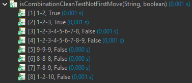
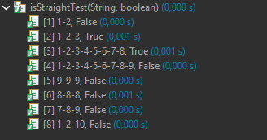
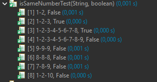
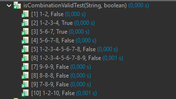

# PROYECTO FINAL DE CURSO 2025/2026 - CHINCHÓN


## Explicación conceptual del proyecto

El proyecto consiste en la realización de un programa en el que se pueda jugar al juego de cartas "Chinchón" (también conocido como "Mono"), que consiste en lo siguiente:

- Se define una puntuación que definirá el momento en el que un jugador que la alcance quedará eliminado.

- Un grupo de jugadores tiene una mano de 7 cartas, mediante la cual deberán realizar combinaciones para acabar teniendo la menor cantidad de puntos (definididos por los valores numéricos de las cartas) sumando todas las  cartas que no hayan podido combinar.

- Para formar combinaciones cada turno consistirá en 2 pasos, el robo y el descarte o cierre, el primero de estos consiste en robar la primera carta de la baraja o coger la carta boca arriba de la pila de descartes y luego descartar una carta o cerrar (usando una carta, siempre los jugadores se deben quedar con 7 cartas al finalizar el turno).

- Para cerrar tienes que tener al menos 6 de las 7 cartas combinadas y no ser el primer turno, al cerrar todos los jugadores usan las combinaciones que tengan y el resto de cartas se suman a los puntos de cada jugador.

- Hay 3 tipos de combinaciones (hay que tener en cuenta que se juega con una baraja española): Iguales (3 o más cartas del mismo valor numérico), Escalera (3 o más cartas consecutivas del mismo palo) y Chinchon (una escalera de 7 cartas).

- La partida termina cuando solo queda un jugador en juego.

## Reglas concretas del proyecto

El juego tiene muchas variantes, para este proyecto se han definido las siguientes características:

- La baraja no contiene ni 8 ni 9. 

- El valor numérico de las cartas de figuras coincide con el de la carta, es decir, el caballo vale 11 y el rey vale 12, no valen todas 10.

- El programa debe funcionar con un número de jugadores o Cpus de entre 2 a 5.

- Si algún jugador cierra con chinchón la partida termina y ese jugador gana.

- Para poder cerrar, si no has combinado las 7 cartas, la que te sobre debe valer 5 o menos y, al cerrar no puedes pasarte de los puntos.

## Estructura del proyecto

La estructura del proyecto es la siguiente.

- Carpeta assets: Contiene imágenes.

- Carpeta docs: Contiene el README.md, el UML del proyecto y los archivos .md que explican el funcionamiento de cada clase, así como un índice de estas.

- Carpeta src: Contiene el código fuente del proyecto, separado en los paquetes app y dominio completamente documentado mediante JavaDoc.

- Carpeta tests: Contiene pruebas unitarias (JUnit) para las clases Entity.java y  FactoryEntity.java.

- Paquete app: Contiene las clases ConsoleInput.java, Game.java, Main.java y Menu.java y la interfaz IGame.java.

- Paquete dominio: Contiene las clases Cpu.java, Deck.java, Entity.java, FactoryEntity.java, los enums CardType.java y Suit.java, el record Card.java y las interfaces ICpu.java, IDeck.java y IEntity.java.

## Funcionamiento del programa

[Enlace al índice de la explicación detallada del proyecto](indiceProyecto.md)

## Arquitectura del programa / Diagrama de clases (UML)


## Pruebas unitarias aplicadas (JUnit)

Primero, he realizado pruebas unitarias para el método de EntityFactory, que comprueba que el tipo de la clase que devuelve el método es correcto, esta prueba tiene enfoque de caja negra porque solo estamos comprobando que unos parámetros devuelve lo esperado, sin mirar la estructura del código y sin comprobar más requisitos.

```java
class FactoryEntityParameterizedTest {
@ParameterizedTest
@CsvSource({
    "1, J1, Entity",
    "1, J2, Entity",
    "1, J3, Entity",
    "1, J4, Entity",
    "2, CPU1, Cpu",
    "2, CPU2, Cpu",
    "2, CPU3, Cpu",
    "2, CPU, Cpu"
})
void buildEntityTest(int entityTipe, String nickname, String expected) {
	FactoryEntity factory = new FactoryEntity();
	IEntity entityResult = factory.buildEntity(entityTipe, nickname);
	assertEquals(expected,entityResult.getClass().getSimpleName());
}
}
```

Imagen con las pruebas realizadas:


Para el resto de pruebas unitarias he usado la clase Entity, que es la que contiene los métodos de validación de jugadas, de este modo podemos saber si los métodos están funcionando correctamente, aquí aplicamos un enfoque de caja blanca ya que necesitamos saber los requisitos del programa para las pruebas, como saber que el 7 y el 10 es un salto válido en las escaleras por ejemplo.

La primera prueba de la clase es al método simpleValidate, que valida que la expresión regular introducida por el usuario es válida (comprueba que al menos hay 3 números separados por - y que no hay 9 o dos números juntos).

```java
@ParameterizedTest
@CsvSource({
    "1-2, False",
    "1-2-3, True",
    "1-2-3-4-5-6-7-8, True",
    "1-2-3-4-5-6-7-8-9, False",
    "9-9-9, False",
    "8-8-8, True",
    "7-8-9, False",
    "1-2-10, False"
})
void simpleValidateCombinationTest(String regexForValidation, boolean expected) {
	Entity e = new Entity("Test");
	boolean result = e.simpleValidateCombination(regexForValidation);
	assertEquals(result,expected);
}
```

Imagen con el método probado:


La segunda prueba de la clase consiste en verificar el funcionamiento del método que evalúa que los índices introducidos por el usuario no se repiten además de que no haya introducido un índice no existente, como el 9 o 10.

```java
@ParameterizedTest
@CsvSource({
        "1-2, True",
        "1-2-3, True",
        "1-2-3-4-5-6-7-8, True",
        "1-2-3-4-5-6-7-8-9, False",
        "9-9-9, False",
        "8-8-8, False",
        "7-8-9, False",
        "1-2-10, False"
    })
void isCombinationCleanTest(String regexForValidation, boolean expected) {
	Entity e = new Entity("Test");
	IDeck d = new Deck();
	d.start(1);
	for (int i = 1; i<=8;i++){
		e.draw(d.drawFromPrincipalDeck());
	}
	boolean result = e.isCombinationClean(regexForValidation);
	assertEquals(result,expected);
}
```


Este método he querido probarlo en un caso "especial", no siempre van a ser 8 cartas en la mano, esto es solo al cerrar, con la primera combinación, supongamos que al jugador solo le quedan en mano 5 cartas.

```java
@ParameterizedTest
@CsvSource({
    "1-2, True",
    "1-2-3, True",
    "1-2-3-4-5-6-7-8, False",
    "1-2-3-4-5-6-7-8-9, False",
    "9-9-9, False",
    "8-8-8, False",
    "7-8-9, False",
    "1-2-10, False"
})
void isCombinationCleanTestNotFirstMove(String regexForValidation, boolean expected) {
	Entity e = new Entity("Test");
	IDeck d = new Deck();
	d.start(1);
	for (int i = 1; i<=5;i++){
		e.draw(d.drawFromPrincipalDeck());
	}
	boolean result = e.isCombinationClean(regexForValidation);
	assertEquals(result,expected);
}
```



La siguiente prueba sirve para comprobar que el método que valida que una combinación sea escalera funciona correctamente.

```java
@ParameterizedTest
@CsvSource({
    "1-2, False",
    "1-2-3, True",
    "1-2-3-4-5-6-7-8, True",
    "1-2-3-4-5-6-7-8-9, False",
    "9-9-9, False",
    "8-8-8, False",
    "7-8-9, False",
    "1-2-10, False"
})
void isStraightTest(String regexForValidation, boolean expected) {
    Entity e = new Entity("Test");
    boolean result;
    Suit st = Suit.ORO;
    CardType ct; 
    for (int i = 1; i<=8;i++){
        ct = switch(i) {
        case 1 -> CardType.UNO;
        case 2 -> CardType.DOS;
        case 3 -> CardType.TRES;
        case 4 -> CardType.CUATRO;
        case 5 -> CardType.CINCO;
        case 6 -> CardType.SEIS;
        case 7 -> CardType.SIETE;
        case 8 -> CardType.SOTA;
        default -> CardType.ERROR;
        };
        e.draw(new Card(ct,st,i));
    }
    if (e.simpleValidateCombination(regexForValidation) && e.isCombinationClean(regexForValidation)) {
        result = e.isStraight(regexForValidation);
    } else {
        result = false;
    }
    assertEquals(result,expected);
}
```



La siguiente prueba comprueba que la combinación contenga todas las cartas del mismo valor numérico.

```java
@ParameterizedTest
@CsvSource({
    "1-2, False",
    "1-2-3, True",
    "1-2-3-4-5-6-7-8, True",
    "1-2-3-4-5-6-7-8-9, False",
    "9-9-9, False",
    "8-8-8, False",
    "7-8-9, False",
    "1-2-10, False"
})
void isSameNumberTest(String regexForValidation, boolean expected) {
    Entity e = new Entity("Test");
    boolean result;
    for (int i = 1; i<=8;i++){
        e.draw(new Card(CardType.SIETE,Suit.ESPADAS,i));
    }
    if (e.simpleValidateCombination(regexForValidation) && e.isCombinationClean(regexForValidation)) {
        result = e.isSameNumber(regexForValidation);
    } else {
        result = false;
    }
    assertEquals(result,expected);
}
```



La siguiente prueba comprueba al completo que una combinación sea válida y que la entidad pueda usarla.

```java
@ParameterizedTest
@CsvSource({
    "1-2, False",
    "1-2-3-4, True",
    "5-6-7, True",
    "5-6-7-8, False",
    "1-2-3-4-5-6-7-8, False",
    "1-2-3-4-5-6-7-8-9, False",
    "9-9-9, False",
    "8-8-8, False",
    "7-8-9, False",
    "1-2-10, False"
})
void isCombinationValidTest(String regexForValidation, boolean expected) {
    Entity e = new Entity("Test");
    boolean result;
    for (int i = 1; i<=3;i++) {
        e.draw(new Card(CardType.SIETE, Suit.ESPADAS,i));
    }
    e.draw(new Card(CardType.UNO, Suit.ORO, 1));
    e.draw(new Card(CardType.DOS, Suit.ORO, 2));
    e.draw(new Card(CardType.TRES, Suit.ORO, 3));
    e.draw(new Card(CardType.CUATRO, Suit.ORO, 4));
    e.draw(new Card(CardType.SOTA, Suit.ORO, 1));
    result = e.isCombinationValid(regexForValidation);
    assertEquals(result,expected);
}
```



Por último he realizado una prueba simple para confirmar que, aunque la entidad pueda combinar 8 cartas porque la combinación sea válida, se devuelva false ya que no se puede nunca combinar con 8 cartas.

```java
@Test
void isCombinationValidSpecialTest() {
    Entity e = new Entity("Test");
    boolean result;
    CardType ct;
    for (int i = 1; i<=8;i++) {
        ct = switch (i) {
        case 1 -> CardType.UNO;
        case 2 -> CardType.DOS;
        case 3 -> CardType.TRES;
        case 4 -> CardType.CUATRO;
        case 5 -> CardType.CINCO;
        case 6 -> CardType.SEIS;
        case 7 -> CardType.SIETE;
        case 8 -> CardType.SOTA;
        default -> CardType.ERROR;
        };
        e.draw(new Card(ct, Suit.ESPADAS,i));
    }
    result = e.isCombinationValid("1-2-3-4-5-6-7-8");
    assertEquals(result,false);
}
```


## Patrones de diseño aplicados al juego

En el proyecto se han aplicado los siguientes patrones de diseño:

- Patrón Singleton:

    He aplicado este patrón 2 veces en el proyecto:

    - ConsoleInput: Ya que quería que solo existiese una única instancia de esta clase, sobre todo por el uso del Scanner como recurso.

        ```java
        public class ConsoleInput {
            private Scanner keyboard;
            private static ConsoleInput instance;
            private ConsoleInput() {
                keyboard = new Scanner(System.in);
            }
            public static ConsoleInput getInstance() {
                if (instance == null) {
                    instance = new ConsoleInput();
                }
                return instance;
            }
        ```

    - Menu: De manera similar, solo quería que existiese una única instancia de esta clase, ya que no he considerado necesario que hubiese más de una.

        ```java
        public class Menu{
            private ConsoleInput ci;
            private static Menu instance;
            private Menu () {
                this.ci = ConsoleInput.getInstance();
            }
            public static Menu getInstance() {
                if (instance == null) {
                    instance = new Menu();
                }
                return instance;
            }
        ```

- Patrón Factory:

    He aplicado este patrón 1 vez en el proyecto:

    - FactoryEntity: Esto ha sido así ya que es la única herencia del proyecto y se puede utilizar de una manera muy simple al pedirle al usuario un 1 o un 2 y, dependiendo de eso que la entidad creada sea una entidad simplpe (jugador) o una Cpu.

        ```java
        public class FactoryEntity {
	        public IEntity buildEntity(int entityTipe, String nickname) {
		        if (entityTipe == 1) {
			        return new Entity(nickname);
		        } else {
			        return new Cpu(nickname);
		        }
	        }
        }
        ```